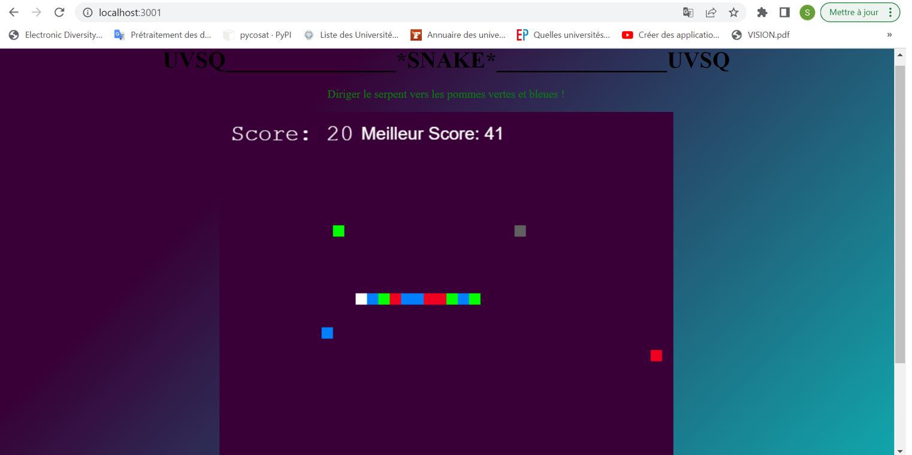

# SNAKE

## <u> INTERFACE 💻</u>



## <u> PRINCIPE DU JEU 💻</u> 

Dans une scène 2D, le joueur dirige un serpent vers des points objectifs (pommes) pour les manger 

<br> En l’occurrence quand le serpent passe sur : 
  <br> > une pomme verte, il s'étend en vert + augmentation du score avec 1 point + son spécial pour cet évenement.
  <br> > une pomme bleue, il s'étend en bleu + augmentation du score avec 5 points + son spécial pour cet évenement.
  <br> > une pomme rouge, il s'étend en rouge + diminution du score avec 1 point + son spécial pour cet évenement.
<br> PS: le meilleure score est aussi enregistré pour le joueur (stockage local).

<br> Le jeu s'arrète lorsque le serpent se cogne : 
  <br> >  l'obstacle gris (son spécial pour cet évenement).
  <br> >  les extrimités du terrain du jeu / les murs (son spécial pour cet évenement). 
  <br> >  lui-meme (son spécial pour cet évenement). 
           

## <u> LANCEMENT DU JEU 💻</u>

1. #### Node JS

   - #### télécharger Node JS : https://nodejs.org/en/download/

   - #### vérifier le téléchargement en tapant dans le terminal la commande :

     ```
     node -v
     ```

     #### Cela affichera la version de notre Node JS (v16.14.0 pour moi)

2. #### NPM

   - #### NPM est un gestionnaire de package, et est déjà téléchargé avec le Node

   - #### confirmer l'installation de NPM en tapant dans le terminal la commande  :

     ```
     npm -v
     ```

   - #### mettre à jour NPM vers la dernière version en tapant dans le terminal une des commandes :

     ```
     npm install npm@latest -g 
     ```
     ```
     npm install 
     ```

3. #### Serveur (taper dans le terminal)
   - ####

      ```
      node index.js 
      ```

4. #### Client (taper dans le Navigateur)
   - ####
   
      ```
      http://localhost:3001/ 
      ```
------


